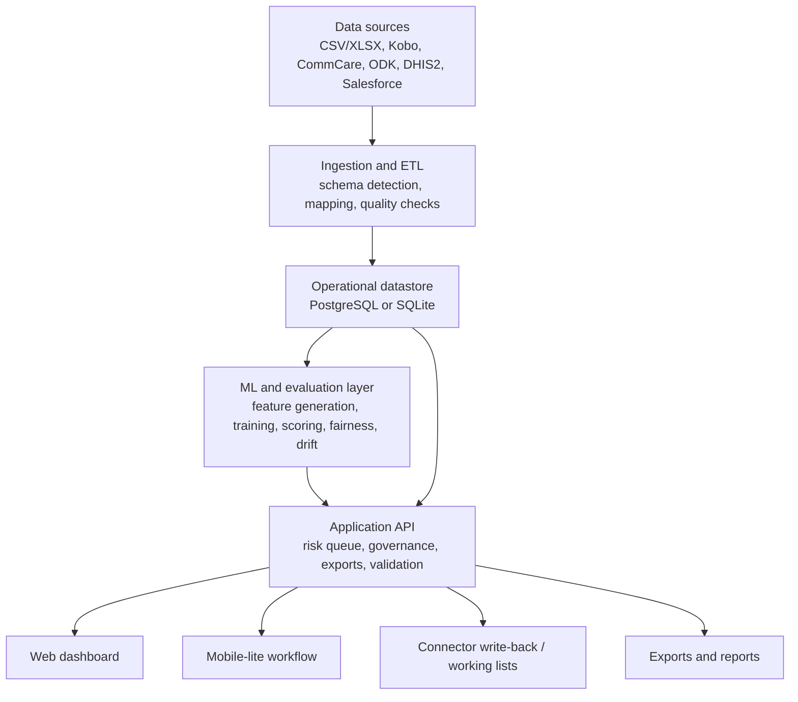

# System Architecture

## Repository Structure

```text
apps/
  api/    FastAPI service, persistence, ETL, ML, jobs, governance
  web/    React dashboard and mobile-lite field interface
docs/     Project, governance, privacy, and audit documentation
infra/    Kubernetes, Terraform, and operational runbooks
scripts/  Validation, benchmarking, and smoke-check tooling
examples/ Example import templates and bundle manifests
```

## High-Level Architecture



## Backend

The backend is a FastAPI application structured around:

- domain models in `apps/api/app/models.py`
- API schemas in `apps/api/app/schemas.py`
- service modules for ingestion, analytics, modeling, governance, privacy, jobs, and connectors
- Alembic migrations for schema evolution

Key responsibilities:

- authentication and authorization
- ingestion and ETL
- risk scoring and model lifecycle
- operational workflow persistence
- privacy and governance enforcement
- exports and reporting
- queue/job orchestration
- validation and shadow-mode evidence capture

## Frontend

The frontend is a React + TypeScript application built around:

- a role-aware operations workspace
- a high-priority risk queue
- validation and evidence panels
- governance and consent controls
- connector and automation management
- a dedicated mobile-lite workflow for low-bandwidth field use

The web app is packaged as a PWA to support offline-capable patterns, though any deployment should validate offline behavior against local infrastructure constraints.

## Data Layer

Primary entities include:

- programs
- beneficiaries
- monitoring events
- interventions
- import batches and data-quality issues
- model versions and feature snapshots
- drift reports and bias audits
- connectors and sync/dispatch runs
- evaluation reports
- shadow runs and shadow run cases
- audit logs and user sessions

## Model Layer

The ML layer includes:

- feature extraction from beneficiary, event, and intervention history
- program-specific and program-type modeling
- elastic-net logistic regression, XGBoost, LightGBM, and stacked ensembles
- SHAP explanation generation
- field-note sentiment features
- fairness audits and drift reporting
- persisted model artifacts and MLflow logging

RetainAI also includes evaluation-only workflows:

- rolling temporal backtests
- holdout backtests
- cross-segment validation
- partner readiness suites
- synthetic stress suites
- shadow-mode evidence capture

## Job Execution

The repository supports two job paths:

- a lightweight database-backed worker
- an optional Celery/Redis path

Jobs currently cover:

- connector syncs
- model retraining
- due automation runs

Operational job metadata includes retries, backoff, and dead-letter state.

## Deployment Topologies

### Local development

- SQLite or local Postgres
- single API process
- local worker
- Vite web app

### Self-hosted NGO deployment

- Postgres
- Redis optional or required depending on chosen job backend
- API + worker + web
- persistent artifact storage
- ingress/TLS

### Cloud deployment

The repository includes Kubernetes and Terraform scaffolding for:

- containerized API, worker, and web services
- managed Postgres
- Redis
- encrypted object storage
- backup defaults
- probes and autoscaling

These assets are substantial, but still require environment-specific validation before a production claim.

## Observability

Built-in observability includes:

- structured JSON request logs
- request IDs
- metrics endpoint
- runtime status endpoint
- worker health endpoint
- smoke-check scripts and operator runbooks

## Security Architecture

The codebase includes:

- JWT auth and rotation
- server-tracked sessions
- RBAC
- audit logging
- connector secret encryption
- tokenized exports
- trusted-host and CORS controls
- security headers
- OIDC or trusted-header SSO options

Detailed security and safeguard behavior is documented in [privacy-and-safeguards.md](privacy-and-safeguards.md) and [../SECURITY.md](../SECURITY.md).
